# Sup, I'm Apollo
> "Life be crazy sometimes 🌇"  

## Who is this "Ubuntufanboy" guy?
- ~Broke~ University CS student
- Retired National Robocup Junior Winner
- Rocket/Robot engineer
- AI Lab owner
- Linux nerd (I use arch btw)
- 我喜欢学中文！（还有看中文电影。。。）
 

## What I'm Working on

- Mechanistic Interpretability (Looking for AI research assistants!)
- Autonomous Food Delivary
- 3D Body Tracking Analysis
- AI Model Optimization 
- Teaching Computer Vision at University Workshops
- Researching Rocket Avionics for Two-Stage Rockets (If only they'd just bring back the Apollo missions 😔)

## Open-Source-Week
Here are some of my projects I released for Open Source Week!:  

- Day 1: **[Tales Of Zenmania](https://github.com/Ubuntufanboy/tales-of-zenmania)** – A small fun game inspired by "1984" by George Orwell
- Day 2: **[Robot Strategy Playground](https://github.com/Ubuntufanboy/robot-simulation)** – A way to place 2 robots against eachother in a match of 2v2 soccer!
- Day 3: **[DJ-CHIP](https://github.com/Ubuntufanboy/DJ-CHIP)** – A customizable way to create true 8-bit music with raw sound waves!
- Day 4: **[Zenith Interpreter](https://github.com/Ubuntufanboy/Zenith)** - A BASIC inspired interpreter that runs entirely in the context window of an LLM.
- Day 5: **[Helios](https://github.com/Ubuntufanboy/Helios)** - My flagship Open Source Week submission. An entire game console with custom Video/Audio and Custom 8 bit CPU. Check it out!

Here are the repositories released by my good friend [Zen](https://github.com/zen-ham) for Open Source Week as well:

- Day 1: **[zhmiscellany](https://github.com/zen-ham/zhmiscellany)** - An organized collection of unique and useful functions/classes/modules/bindings.
- Day 2: **[garrysmod workshop scripts](https://github.com/zen-ham/garrysmod_workshop_scripts)** - Scripts for interacting with the steam workshop and building files related to the steam workshop
- Day 3: **[Tales of Zenmania 2](https://github.com/zen-ham/tales_of_zenmania_2)** - Far expanded version of my original game "Tales of Zenmania".
- Day 4: **[Local LLM Agent](https://github.com/zen-ham/local_llm_agent)** - An LLM agent implementation in python.
- Day 5: **[Search OCR](https://github.com/zen-ham/Search-OCR)** - Local OCR indexer and search engine, digests all image files on the system into a pickle cluster and allows key word or sentence searching in real time across 100K+ files.
