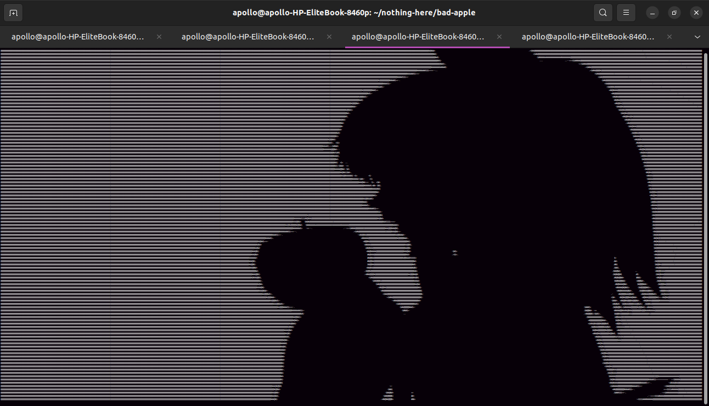

# *Hello*

## A bit about me

- I am a programmer who is very passionate about FOSS. I try to contribute in every way I can.
- I am learning Chinese for fun in my free time
- I been using linux since I was 8 years old! (Very long time)
- I Been using python for 2 years!
- I am trying to learn more about networking and media processing
- I like to cook!

## Screenshot of my work

## Here is my home made audio-codec

https://github.com/Ubuntufanboy/Ubuntufanboy/assets/82414370/c6d20ac3-a225-4f66-87c8-63f93623cc7a

## Stuff that interests me

#1 Linux
#2 Chinese content
#3 Media processing (Basically dealing with videos, audio, and images)
#4 Networking
#5 Microcontrollers

# Projects I made that you should check out!

- Silver ( A python library for managing sound) https://www.github.com/Ubuntufanboy/Silver
- Dolphin ( Automatic video generation ) https://www.github.com/Ubuntufanboy/Dolphin
- bad-apple (Playing the video Bad Apple!! in the linux terminal) https://www.github.com/Ubuntufanboy/bad-apple
- Spammer (Using macros to either annoy your friends or to automate key strokes) https://www.github.com/Ubuntufanboy/Spammer

